# 🔐 Wazuh SSH Brute Force Detection (Detection Engineering Project)

## 📌 Overview

This project demonstrates the detection of SSH brute force attacks using Wazuh SIEM through custom detection engineering techniques. A simulated attack was performed using Hydra from a Kali Linux system targeting a Linux server. Detection rules were created to identify both early warning indicators and confirmed brute force activity, providing layered visibility into authentication attacks.

---

## 🧪 Lab Environment

The lab consists of three systems:

* Kali Linux (Attacker)
* Linux Server (Target)
* Wazuh SIEM (Monitoring & Detection)

All systems are connected within a private virtual network.

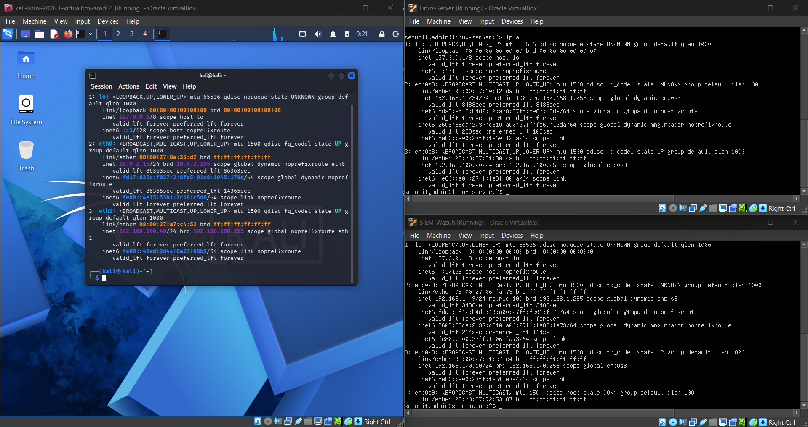

---

## 🌐 Network Connectivity Validation

Connectivity between systems was verified to ensure proper communication across the environment. This step is critical before performing any attack or monitoring activity.

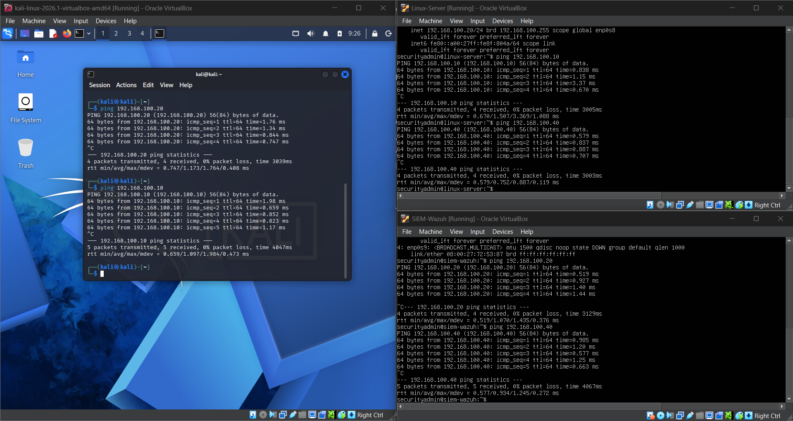

---

## 🔐 SSH Service Verification

The SSH service was confirmed to be active and running on the target system. This ensures the system is accessible and can be targeted during the attack simulation.

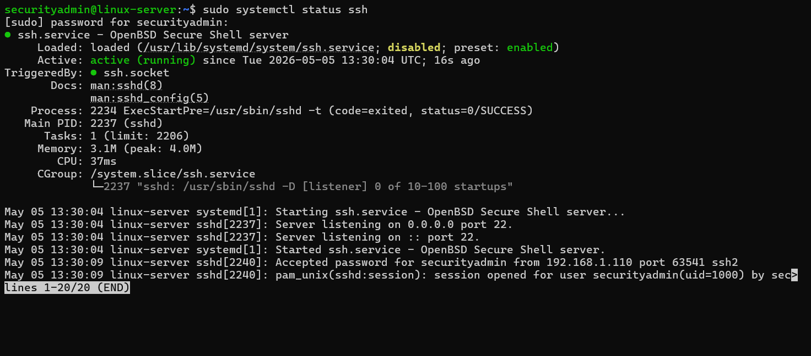

---

## 📉 Initial Failed Login Activity

Initial failed login attempts were generated and verified in system logs. This confirms that authentication failures are being properly recorded before detection rules are applied.

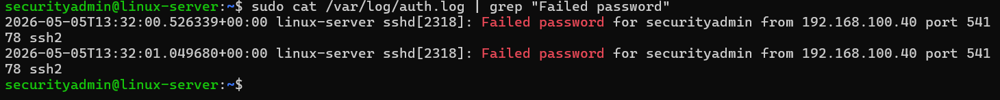

---

## 🔑 Password Wordlist Preparation

A custom password list was created to simulate realistic brute force attempts using common weak passwords.

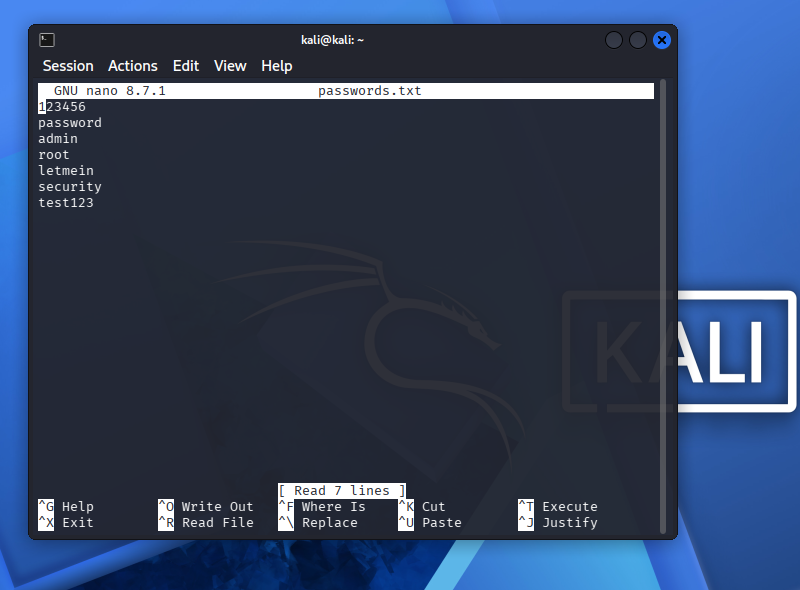

---

## 💥 Brute Force Attack Simulation (Hydra)

Hydra was used to perform a brute force attack against the SSH service using the prepared wordlist. This simulates an attacker attempting to gain unauthorized access.

```bash
hydra -l securityadmin -P passwords.txt ssh://192.168.100.20
```

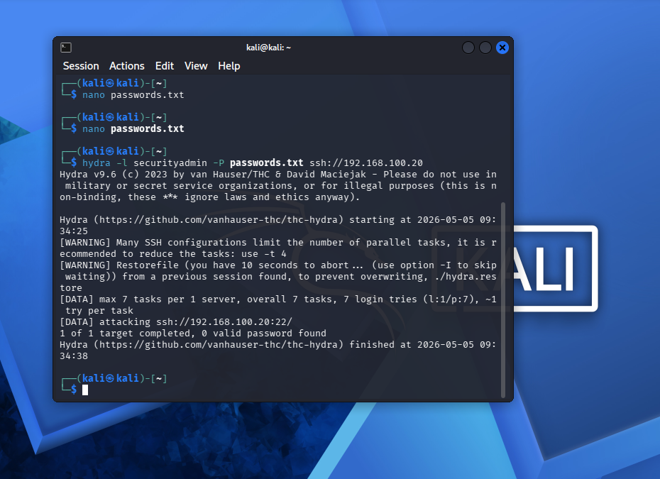

---

## 📊 Increased Failed Login Activity

Following the attack, multiple failed login attempts were observed in the system logs, confirming that the attack generated significant authentication failures.

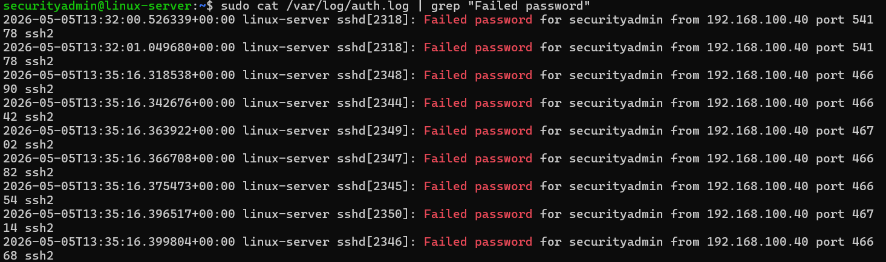

---

## 🛡️ Wazuh Detection (Base Rules)

Wazuh successfully detected authentication failures using built-in rules. These events were visible within the SIEM dashboard.

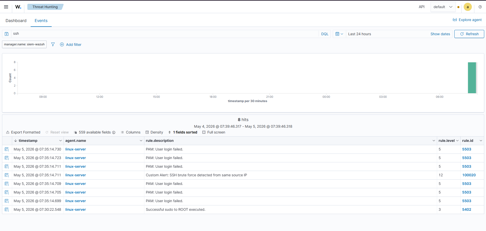

---

## 🔍 Alert Details Analysis

Detailed inspection of alerts shows correlation of failed login attempts from a single source IP, indicating suspicious activity.

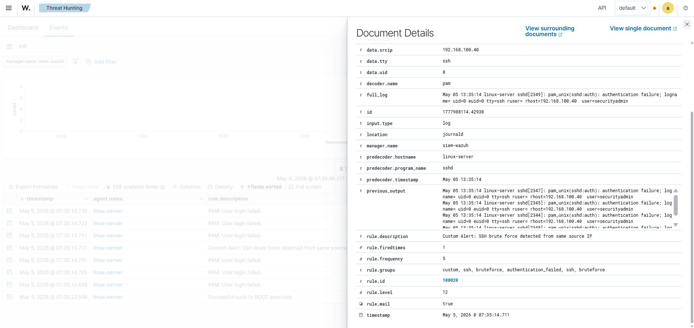

---

## ⚙️ Custom Brute Force Detection Rule

A custom rule was created to detect brute force behavior by correlating multiple failed login attempts within a defined timeframe.

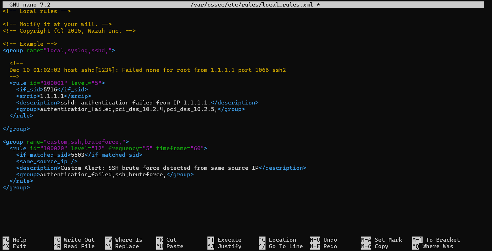

---

## ⚠️ Early Warning Detection Rule

An additional rule was created to act as an early warning system by detecting a smaller number of failed attempts before escalation.

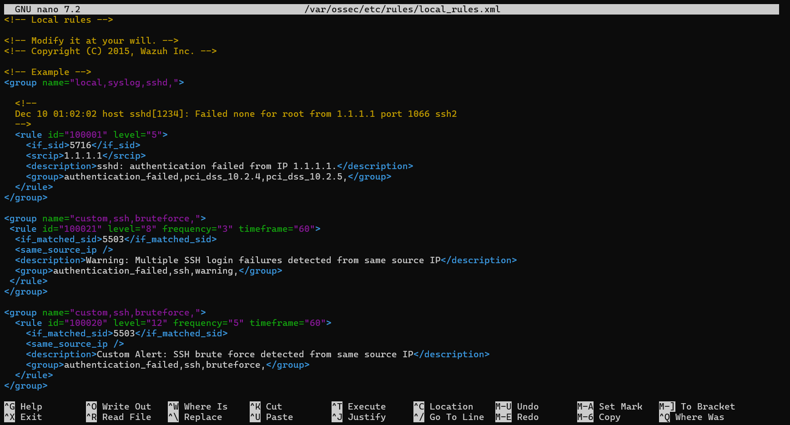

---

## 🔁 Wazuh Service Restart

The Wazuh manager was restarted to apply the newly created detection rules.

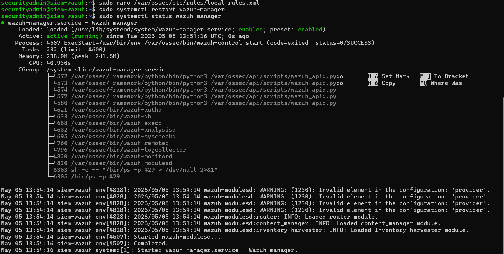

---

## 💥 Final Attack Simulation (Layered Detection)

A second brute force attack was executed to validate both detection rules. This confirms layered detection capability.

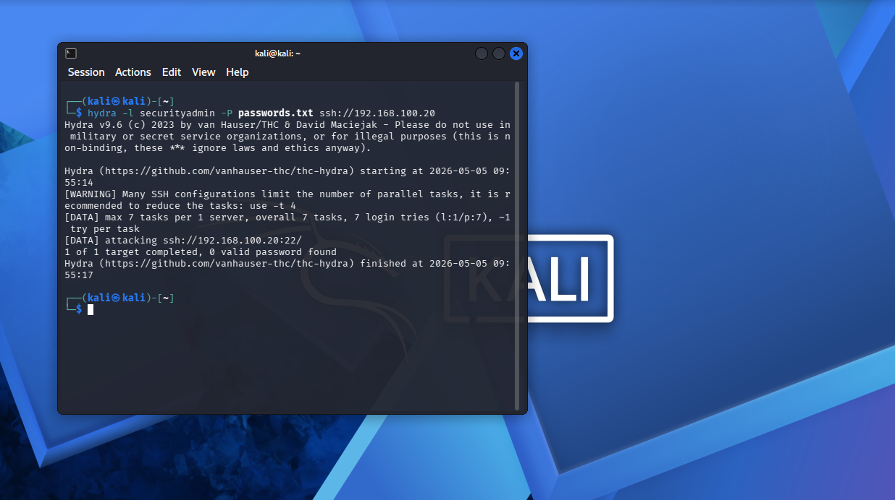

---

## 🚨 Layered Detection Results

Both early warning and high-severity alerts were successfully triggered, demonstrating effective detection engineering implementation.

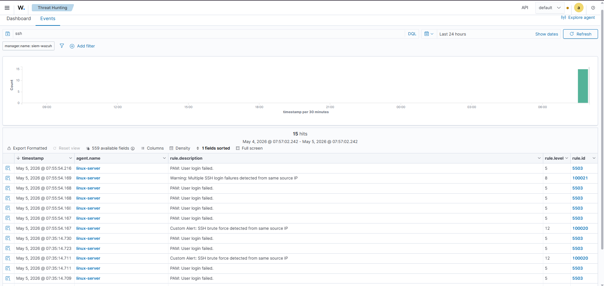

---

## 🎯 MITRE ATT&CK Mapping

This activity primarily maps to:

* **T1110 – Brute Force**
  Adversaries attempt to gain access by repeatedly trying multiple password combinations.

Although no successful authentication occurred during this simulation, continued brute force activity could lead to compromise through:

* **T1078 – Valid Accounts (Potential Escalation)**
  If valid credentials are discovered, attackers may gain legitimate access to the system.

This highlights the importance of early detection to prevent escalation from failed attempts to full compromise.

---

## 🚨 What If the Attacker Succeeds?

If a brute force attack successfully identifies valid credentials, the attack transitions from failed authentication attempts to an active compromise.

In this scenario, detection focus must shift from failure patterns to:

* Successful login anomalies (unexpected logins)
* Logins from unusual IP addresses or locations
* Privilege escalation activity
* Lateral movement or persistence techniques

Future detection enhancements could include:

* Alerts for successful SSH logins following multiple failures
* Detection of unusual login times or behaviors
* Monitoring for post-authentication activity

This demonstrates the importance of not only detecting attacks early, but also preparing for post-compromise detection scenarios.

---

## 📊 Conclusion

This project demonstrates how detection engineering can be applied to identify brute force attacks using Wazuh SIEM. By implementing both early warning and high-confidence detection rules, visibility into attack patterns is significantly improved.

The layered approach enhances security monitoring by allowing defenders to detect and respond to suspicious behavior before full compromise occurs. Additionally, understanding how attacks may progress beyond initial access provides a stronger defensive strategy.

---

## 🔧 Future Improvements

* Implement automated response (IP blocking)
* Add geolocation enrichment for attacker IPs
* Detect successful login anomalies
* Integrate alerting (email, Slack, SIEM notifications)
* Expand detection to additional attack techniques

---

## 🌐 Portfolio

View this project in my full portfolio:

👉 https://your-portfolio-link-here

*(Link will be updated once added to SecurePath portfolio)*

---

## 📌 Resume Bullet

Implemented layered detection logic in Wazuh SIEM to identify SSH brute force attacks, correlating authentication failures into early warning and high-severity alerts through custom rule development and attack simulation.
